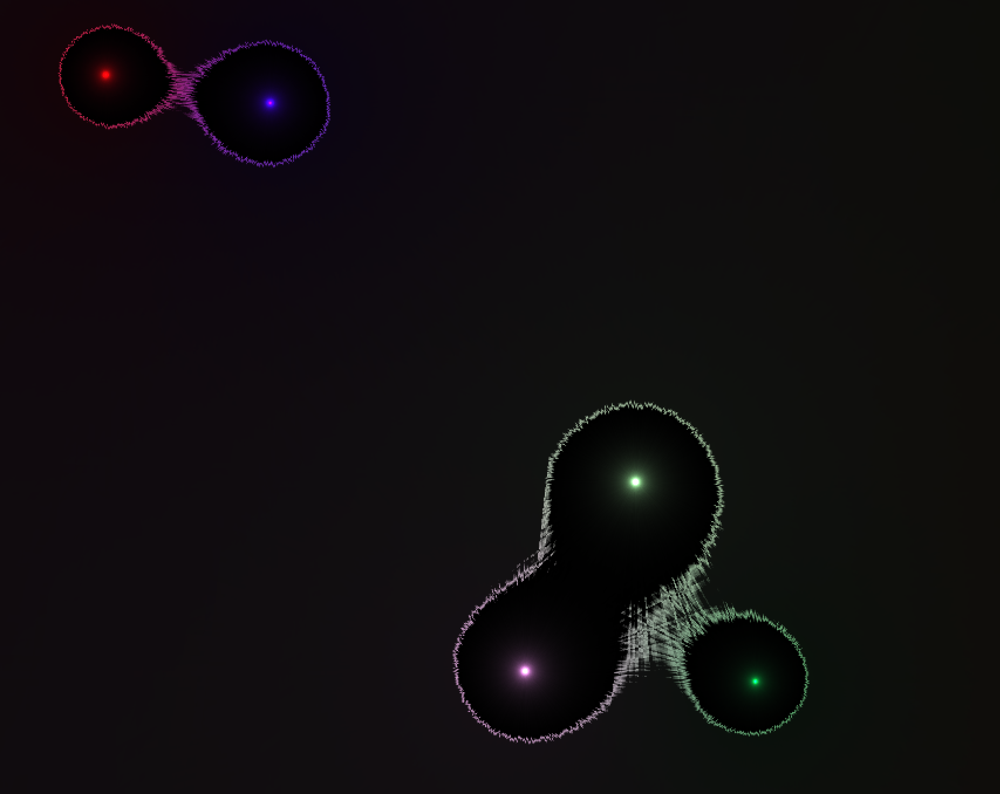
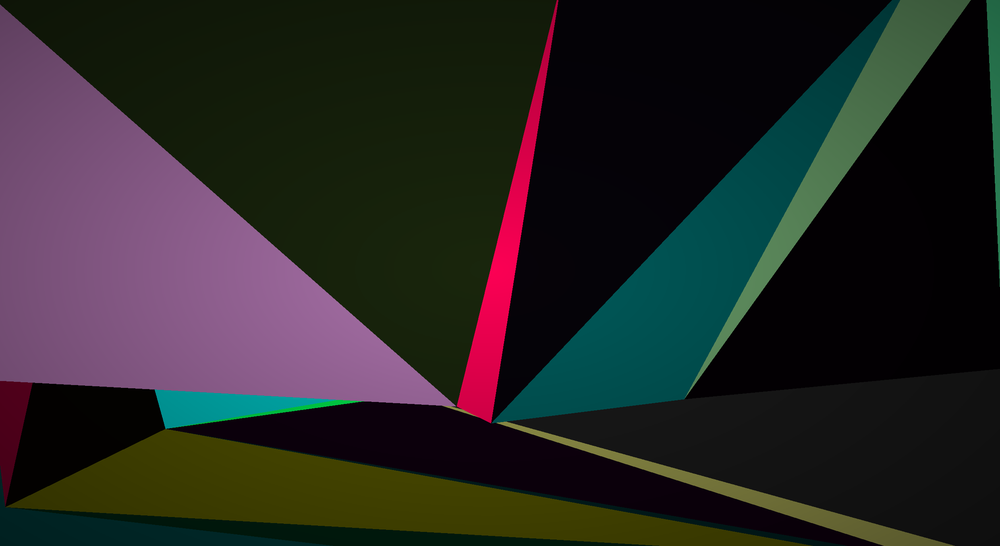

# Pretty Wallpaper
The idea is that using graphics libraries and basic maths
actually makes some really good looking visuals.

The `Renderer` class takes care of all the structure so
the base classes can just do the drawing.

(more images in [images](images/))

## CircleRenderer
Moving circles that merge in a nice way.
Think there's a name for the algorithm, but I don't remember.
But it simulates how atoms attract (either that or electrons).
It looks like basic bubbles at its core,
but adding some variables/randomness changes the visuals drastically.
Pretty expensive thought since you have to run through each pixel for each circle.


## TriangleRenderer
Generates triangles on the screen.
Each triangle fades in/out at a different interval.
They're supposed to not overlap, but I only realized that they do after writting the generation code.
Might write a proper way to generate them, but the algorithm I have in mind would be O(N^2).



# Running
```bash
cmake -B out
cd out
make
./pretty-wallpaper
```
Should fail to compile on Windows because even though this uses GLFW, 
some X11 functions are used in order to (optionally) use the window as a wallpaper.

Fixing this isn't complicated but not really relevant to me.
If you want to run it on Windows for some reason, just comment out
the lines that give you a compile errors and you should be good.


# TODO
1. json config file and a way for the program to restart each time the file is updates

2. glad/stb\_image as proper external dependancies and remove include directory

3. organize res/ directory by "renderer type"

4. some way to install this whole thing? idk

5. (after config) add a way to render to video

6. proper triangle generating
